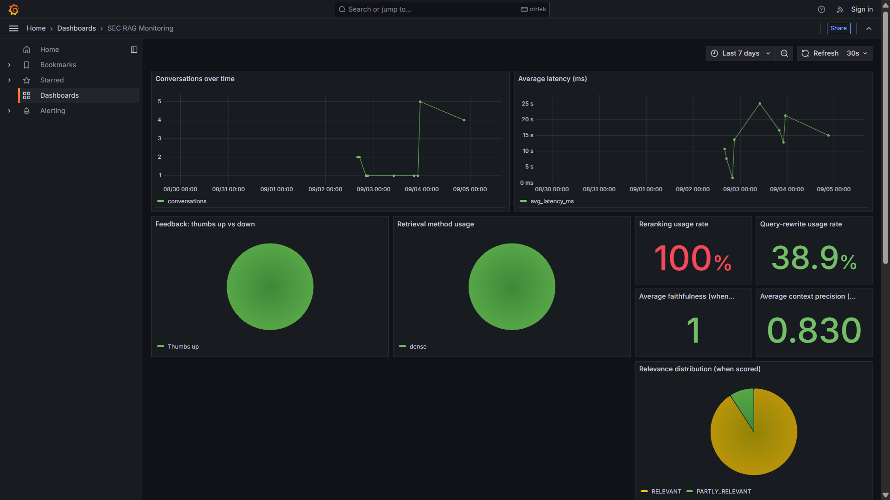

# SEC 10-K RAG Assistant

A Retrieval-Augmented Generation system that answers questions about SEC 10-K annual
filings for 6 public companies across two sectors — **tech** (GOOGL, MSFT, NVDA) and
**banking** (JPM, GS, BAC) — grounding every answer in retrieved passages with
traceable `[number]` citations.

**Problem it solves:** 10-K filings are long, dense, and hard to compare across
companies or sectors. Reading through several of them to answer a question like "how
do tech and banking companies differ in their AI-related risk disclosures?" takes a
long time by hand. This assistant lets you ask that question in plain English and get
back a cited answer drawn only from the actual filing text — no fabrication, and
every claim traceable to its source passage — in seconds.

Built as a DataTalksClub LLM Zoomcamp capstone project.

## Demo

**"Compare both" mode** — traditional and agentic RAG answering the same question side by side:


**Grafana monitoring dashboard**, populated with real usage data:



**Live deployment** (GCP free-tier VM): [app](http://35.196.253.183:8501) ·
[Grafana dashboard](http://35.196.253.183:3000) — no login needed for either. See
[docs/cloud-deployment.md](docs/cloud-deployment.md) for setup details and a known
latency trade-off of the free tier (a heavy multi-search question can take a few
minutes; simple questions are much faster).

## Quick start

```bash
git clone https://github.com/asudarmo/sec_rag_dtc_llm.git
cd sec_rag_dtc_llm
cp .env.example .env   # fill in GEMINI_API_KEY at minimum
docker compose up -d --build
```

Open http://localhost:8501 (app) and http://localhost:3000 (Grafana dashboard, no
login needed). Full setup details, local (non-Docker) usage, and rebuild notes are in
**[docs/setup.md](docs/setup.md)**.

## How it works

```
question ──▶ [optional query rewrite] ──▶ retrieve (dense/sparse/hybrid)
          ──▶ [optional rerank] ──▶ build context ──▶ Gemini generate ──▶ cited answer
```

Automated ingestion (dlt) pulls SEC filings, chunks them, and embeds them into
ChromaDB ahead of time (a prebuilt vector store is committed, so this isn't required
just to run the app). Every retrieval stage — method, reranking, query rewriting — is
independently toggleable, which is what makes the evaluation sweep in
[docs/evaluation.md](docs/evaluation.md) possible. An **agentic RAG** mode is also
available alongside the fixed pipeline, letting an LLM decide for itself when and how
to search — see [docs/agentic-rag.md](docs/agentic-rag.md) for how it compares.

Every interaction is logged to Postgres with an accompanying Grafana dashboard, and
the app collects both human 👍/👎 feedback and optional LLM-as-judge scoring — see
[docs/monitoring.md](docs/monitoring.md).

## Rubric coverage

This project targets the [DTC LLM Zoomcamp rubric](https://github.com/DataTalksClub/llm-zoomcamp/blob/main/project.md):

| Criterion | Where |
|---|---|
| Problem description | this README |
| Retrieval flow (knowledge base + LLM) | [docs/architecture.md](docs/architecture.md) |
| Retrieval evaluation (multiple approaches) | [docs/evaluation.md](docs/evaluation.md) |
| LLM evaluation (multiple approaches) | [docs/evaluation.md](docs/evaluation.md) |
| Interface | Streamlit app (`app.py`) |
| Automated ingestion pipeline (dlt) | [docs/ingestion.md](docs/ingestion.md) |
| Monitoring (feedback + ≥5-chart dashboard) | [docs/monitoring.md](docs/monitoring.md) |
| Containerization (full docker-compose) | [docs/setup.md](docs/setup.md) |
| Reproducibility | [docs/setup.md](docs/setup.md) |
| Best practice: hybrid search | [docs/architecture.md](docs/architecture.md) |
| Best practice: document re-ranking | [docs/architecture.md](docs/architecture.md) |
| Best practice: query rewriting | [docs/architecture.md](docs/architecture.md) |
| Extra: agentic RAG | [docs/agentic-rag.md](docs/agentic-rag.md) |
| Bonus: cloud deployment | [docs/cloud-deployment.md](docs/cloud-deployment.md) — [live app](http://35.196.253.183:8501) |

## Documentation

- [Setup & running](docs/setup.md) — prerequisites, `.env`, Docker Compose, local `uv` usage, reproducibility
- [Ingestion pipeline](docs/ingestion.md) — data, automated (dlt) and manual ingestion
- [Architecture: retrieval & generation](docs/architecture.md) — dense/sparse/hybrid retrieval, reranking, query rewriting, filtering
- [Evaluation](docs/evaluation.md) — retrieval evaluation (Hit Rate/MRR) and LLM-judge generation evaluation, with results
- [Agentic RAG](docs/agentic-rag.md) — LLM-driven tool-calling mode, compared against the fixed pipeline
- [Monitoring](docs/monitoring.md) — Postgres schema, Grafana dashboard, LLM-as-judge metrics
- [Cloud deployment](docs/cloud-deployment.md) — GCP free-tier VM setup, deployed and stress-tested
- [Changelog](CHANGELOG.md) — development history: bugs found and fixed, lessons learned, notable decisions

## Project structure

```
sec_rag_dtc_llm/
├── ingestion/       # download, chunk, embed — plus the dlt-orchestrated pipeline
├── rag/             # retrieval (dense/sparse/hybrid + rerank/rewrite/fields) + generation + agentic RAG (agent.py)
├── eval/            # retrieval & LLM evaluation, incl. traditional-vs-agentic comparison
├── monitoring/      # Postgres schema/logging + Grafana provisioning & dashboards
├── data/processed/  # chunks.json (committed seed data)
├── chroma_db/       # prebuilt vector store (committed seed data)
├── app.py           # Streamlit UI
├── Dockerfile
├── docker-compose.yml
├── docs/            # detailed documentation (linked above)
└── tests/
```

## Acknowledgements

This project's domain problem and initial dataset were inspired by an earlier project
of mine, **finsignal-rag**, built for the SMM694 Applied NLP module at City,
University of London. That project established the SEC 10-K domain (6 tickers across
tech/banking) and a basic dense-retrieval + Gemini RAG pipeline.

This capstone is a substantially rebuilt and extended system, not a port of that
work, developed independently for the DataTalksClub LLM Zoomcamp under this course's
own requirements. Major additions beyond the original assignment:

- **Hybrid search** — dense + BM25 sparse retrieval fused via Reciprocal Rank Fusion
- **Cross-encoder reranking** over the retrieved candidate pool
- **LLM-based query rewriting** for cross-sector/cross-company comparison questions
- **Automated ingestion** via [dlt](https://dlthub.com/), replacing manual download/chunk scripts
- **Agentic RAG** — an LLM-driven tool-calling mode alongside the fixed pipeline, with a side-by-side comparison view and its own evaluation
- **Monitoring** — a full Postgres + Grafana stack with user feedback and LLM-as-judge scoring across 3 metrics
- **Quantitative evaluation harness** — Hit Rate/MRR retrieval evaluation and LLM-judge generation evaluation across multiple configs
- **Full containerization** via docker-compose

See [CHANGELOG.md](CHANGELOG.md) for the complete development history.
