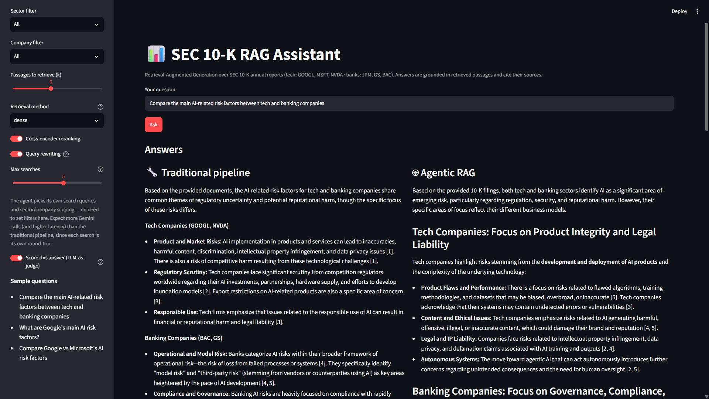

# Agentic RAG (extra accomplishment)

Alongside the fixed retrieve-then-generate pipeline (see [architecture.md](architecture.md)),
`rag/agent.py` implements an **agentic RAG** mode: instead of a fixed sequence of
retrieval steps, an LLM-driven loop decides for itself when and how to search, using a
single `search_filings` tool (Gemini function-calling, matching the DTC course's own
Module 1 agentic-RAG pattern — `01-agentic-rag`). It can search once per company or
sector when comparing, or search again with different wording if a result isn't
useful, before producing a final answer.

```bash
uv run python -m rag.agent "Compare the main AI-related risk factors between tech and banking companies"
```

## Why one tool, not several

This domain has exactly one kind of action (retrieve passages, optionally scoped to a
sector or company) — Gemini already knows the 6-ticker/2-sector mapping from
training, so a second tool (e.g. a ticker lookup) would add complexity without adding
real capability. This mirrors the course's own single-tool example. The loop is
hand-rolled (Gemini's automatic function calling is explicitly disabled) rather than
using the SDK's built-in agentic loop, so every tool call can be logged and a
`MAX_ITERATIONS` safety cap enforced — the course's own bare example has no such cap.

## Using it in the app

The Streamlit sidebar's **Mode** control has three options:

- **Traditional pipeline** — the fixed pipeline described in [architecture.md](architecture.md)
- **Agentic RAG** — only exposes a "max searches" safety-cap slider, since the model
  picks its own queries and sector/ticker scoping
- **Compare both** — runs both concurrently on the same question and shows them side
  by side in two columns, each with its own sources and 👍/👎 feedback, with a
  per-side loading indicator so you can see the (faster) traditional answer land
  while agentic is still searching



## Traditional vs. agentic, compared

`eval/agentic_eval.py` compares agentic RAG against the best *fixed* config
(`dense+rerank+rewrite`, not a weaker baseline) on the same 15 comparison questions
and same judge used in [evaluation.md](evaluation.md), for direct comparability.

```bash
uv run python -m eval.agentic_eval   # ~30 answer+judge pairs (15 questions x 2 configs); resumable
```

**Results** (`eval/results/agentic_eval.json`):

| config | faithfulness | context_precision | % relevant | latency (s) | avg Gemini calls |
|---|---|---|---|---|---|
| traditional (dense+rerank+rewrite) | 1.000 | 0.904 | 100% | 5.35 | 2.00 |
| **agentic** | 1.000 | **0.985** | 100% | 17.61 | 2.07 |

Both are perfectly faithful and fully relevant on this question set. Agentic RAG
scores a bit higher on context precision (its own targeted per-company/sector
searches avoid a few off-topic passages the fixed pipeline occasionally pulls in),
but at roughly **3.3x the latency** — every tool call is a full retrieval round-trip
plus an extra Gemini round-trip.

Interestingly, the agent's call count came in *lower* than expected going in (~2
total Gemini calls/question, not ~4): on every comparison question, it issued both
`search_filings` calls together in a single model turn, converging on the same "one
search per side" strategy the fixed pipeline's query rewriting was hand-built to
encode — without being told that rule explicitly.

**Take:** agentic RAG isn't a strict upgrade here — a modest precision gain for a
real latency cost, on a small fixed-domain corpus where the fixed pipeline's own
query-rewrite step already handles comparison questions well. It's a genuinely
different architecture, and the comparison is the interesting part: a
domain-appropriate fixed pipeline can match a general-purpose agent loop when the
domain's decomposition rule is simple and already known.
